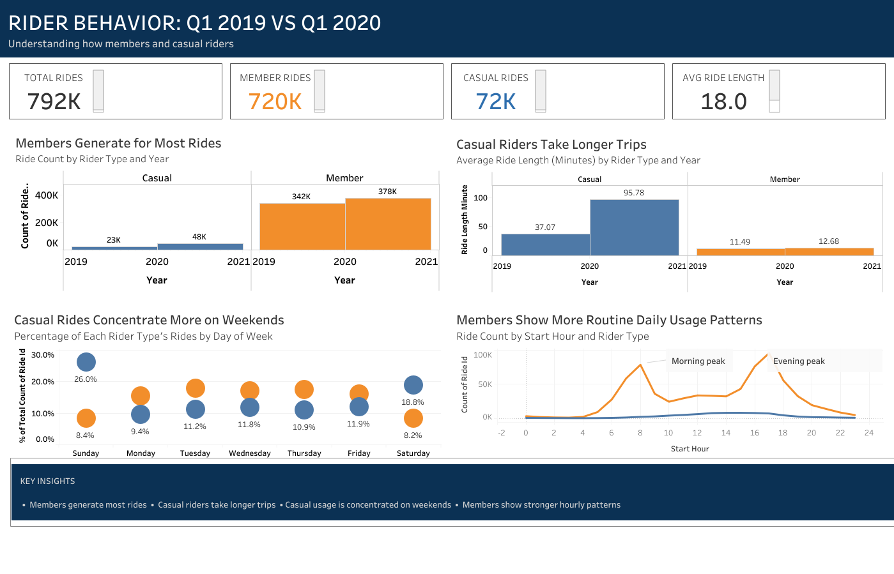

# Cyclistic Bike-Share Analysis

## Project Overview

This portfolio project analyzes Divvy bike-share trip data from Q1 2019 and Q1 2020 to understand how annual members and casual riders use the service differently.

The analysis follows the Ask, Prepare, Process, Analyze, Share, and Act framework.

## Business Task

How do annual members and casual riders use Cyclistic bikes differently, and how can the findings support strategies to convert casual riders into annual members?

## Data Scope

- Divvy Q1 2019 trip data
- Divvy Q1 2020 trip data
- Approximately 792,000 analyzed ride records
- Q1 year-over-year comparison

> This project does not represent a complete annual or seasonal analysis.

## Tools

- Python
- Pandas
- Google Colab
- Google Sheets
- Tableau
- Microsoft PowerPoint

## Analysis Process

### Ask

Defined the business objective and identified the primary stakeholders.

### Prepare

Reviewed the dataset structure, scope, credibility, licensing, and limitations.

### Process

Standardized the 2019 and 2020 schemas, aligned rider categories, converted datetime fields, created analytical variables, and combined both datasets.

### Analyze

Compared ride volume, ride duration, weekday behavior, and hourly usage patterns between members and casual riders.

### Share

Created an executive Tableau dashboard and PowerPoint presentation.

### Act

Developed data-backed marketing recommendations to support membership conversion.

## Key Findings

1. Members generated the majority of recorded rides.
2. Casual riders took longer rides on average.
3. Casual usage was more concentrated on weekends.
4. Member rides showed stronger morning and evening usage peaks.

## Recommendations

1. Launch weekend-focused membership campaigns.
2. Promote membership value after longer casual rides.
3. Test segmented digital campaigns based on rider behavior and usage time.

## Dashboard

The final dashboard is available in:

- [Dashboard screenshot](dashboard/cyclistic_dashboard.png)

## Interactive Dashboard

[View the interactive Tableau dashboard](https://public.tableau.com/shared/ZF6PXPNS3?:display_count=n&:origin=viz_share_link)

## Presentation

- [Download the PowerPoint](presentation/cyclistic_case_study.pptx)

## Project Files

- [`notebooks/`](notebooks/) — Python analysis notebook
- [`data/summary/`](data/summary/) — Aggregated analytical outputs
- [`dashboard/`](dashboard/) — Tableau dashboard screenshot
- [`presentation/`](presentation/) — Executive presentation
- [`docs/`](docs/) — Methodology and documentation

## Limitations

- The datasets cover Q1 2019 and Q1 2020 only.
- Trip purposes are not directly recorded.
- Weather, pricing, and campaign data were not included.
- No rider-level identifier was available for tracking repeat users.

## Disclaimer

This is an independent educational portfolio project. It is not affiliated with or endorsed by Divvy, Lyft, or the City of Chicago.

The original source datasets are not redistributed in this repository.
