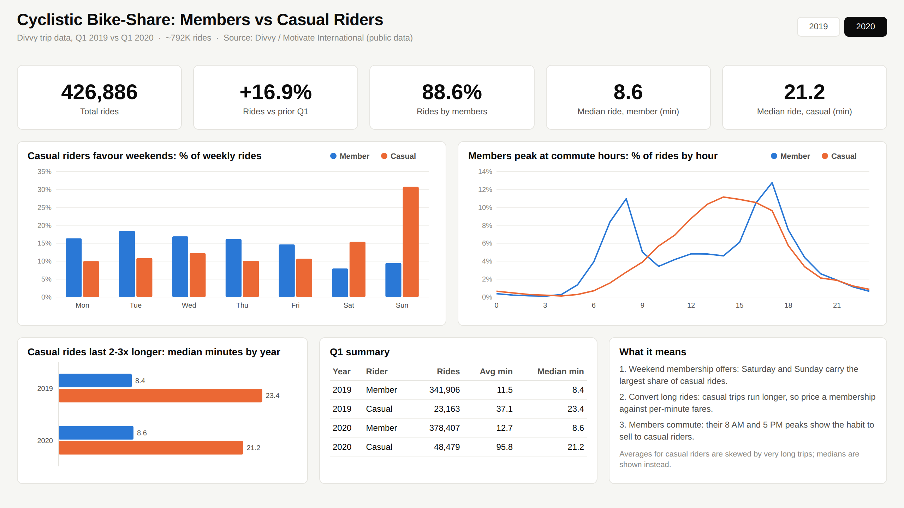

# Power BI Dashboard



> The image is a rendered preview of the report layout with the real summary numbers (year filter = 2020).

A one-page Power BI report built as a **Power BI Project (PBIP)**: the semantic model is stored as TMDL and the report as PBIR, so every table, DAX measure, and visual is plain text and reviewable on GitHub.

## Open it

1. Install [Power BI Desktop](https://www.microsoft.com/power-bi/desktop) (Windows, 2024 or newer).
2. Clone or download this repository.
3. Open `dashboards/powerbi/Cyclistic.pbip`.
4. Select **Refresh**. When asked for credentials for `raw.githubusercontent.com`, choose **Anonymous** and **Connect**.

The model loads the three aggregated CSVs in [`data/summary/`](../../data/summary/) straight from GitHub. To work offline, change the `DataSourceUrl` parameter (Transform data > Manage parameters) or point the queries at your local copy.

To share a single file, use **File > Save as** and save a `.pbix` copy.

## Report

| Area | What it shows |
|---|---|
| Year slicer | Filters the KPIs and the two usage-pattern charts (defaults to 2020) |
| KPI cards | Total rides, change vs prior Q1, member share, median ride length for each rider type |
| Weekday chart | Share of each group's weekly rides by day (Mon to Sun) |
| Hourly chart | Share of each group's rides by start hour |
| Duration chart | Median ride length by year and rider type |
| Q1 summary | Rides, average and median minutes for both years |

## Model

| Table | Type | Source |
|---|---|---|
| Rider Summary | Fact | `summary_by_rider_year.csv` |
| Rides by Weekday | Fact | `summary_by_weekday.csv` |
| Rides by Hour | Fact | `summary_by_hour.csv` |
| Rider Type | Dimension | Member, Casual |
| Year | Dimension | 2019, 2020 |
| Key Measures | Measures only | DAX |

- Each fact table relates many-to-one to `Rider Type` and `Year`, so one slicer or legend filters every visual.
- Fact tables are cleaned in Power Query (renamed columns, typed values, Monday-first weekday order).
- All measures live in the `Key Measures` table. A readable copy is in [`measures.dax`](measures.dax).
- Medians are not additive, so `Median Ride (min)` only returns a value for one rider type in one year.

## Theme

[`theme/cyclistic-minimal-theme.json`](theme/cyclistic-minimal-theme.json) is a minimal theme: light neutral canvas, white cards with a thin border, recessive gridlines, and two series colors (Member blue `#2A78D6`, Casual orange `#EB6834`) checked for color-blind separation. Import it in any report via **View > Themes > Browse for themes**.

## Files

```
powerbi/
├── Cyclistic.pbip                 # open this in Power BI Desktop
├── Cyclistic.SemanticModel/       # TMDL: tables, Power Query, relationships, measures
├── Cyclistic.Report/              # PBIR: page, visuals, theme
├── measures.dax                   # all DAX measures in one file
├── theme/                         # reusable report theme
└── preview.png
```

## Troubleshooting

- **"This file uses features not supported"**: update Power BI Desktop, or enable *File > Options > Preview features > Power BI Project (.pbip) save option* and *Store reports using enhanced metadata format (PBIR)*.
- **Visuals show blanks after opening**: the model has no cached data in Git. Select **Refresh** once.
